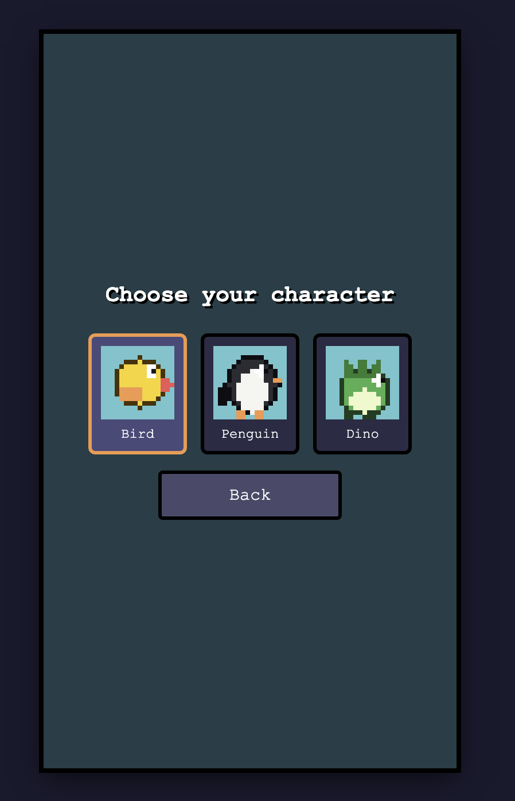
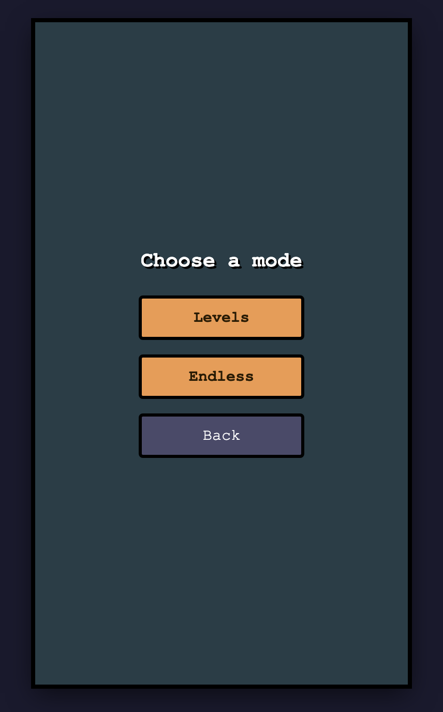
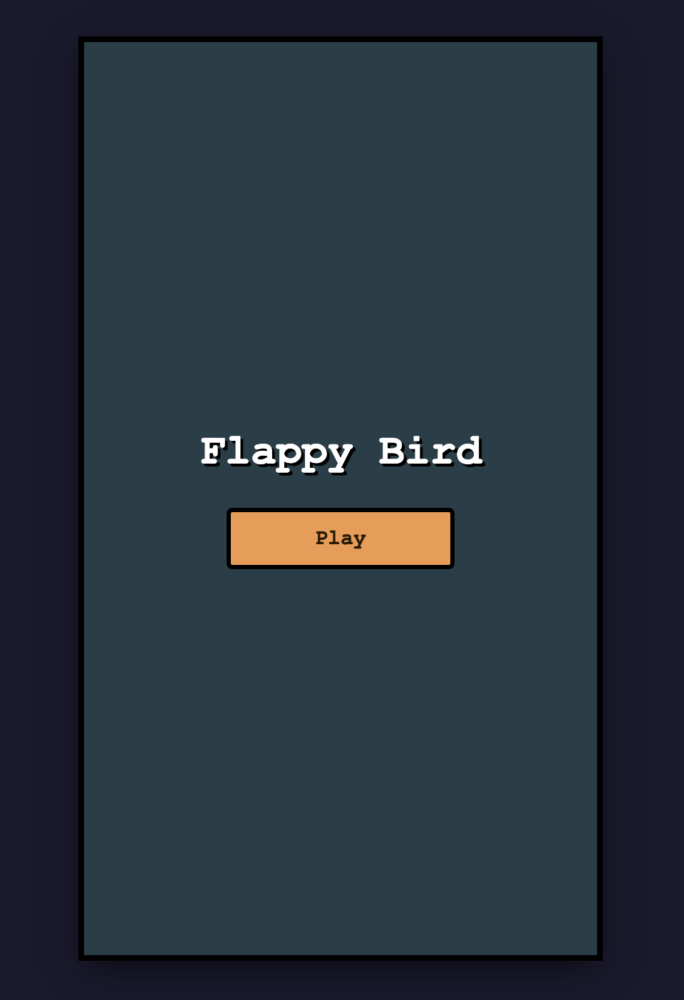
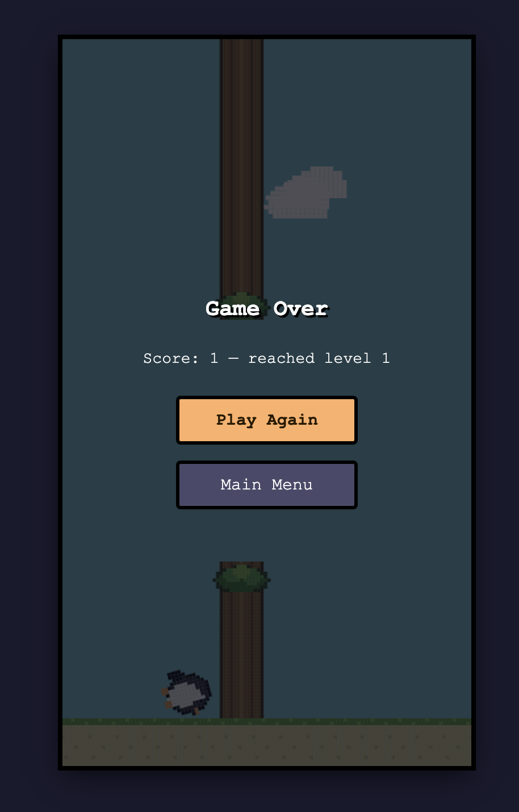

# Flappy Bird

A little Flappy Bird clone I built for fun. You pick a character, dodge some tree trunks, try not to die immediately. Pure HTML/CSS/JS, no build step required. Just open `index.html` in a browser.


## How to run it

```
open index.html
```

That's it. Or serve it however you like (`python3 -m http.server`, etc.) if you'd rather not open a file URL directly.

## Controls

- **Space / click / tap:** flap
- **B:** pause
- **Space:** also resumes when paused, restarts after you die, and starts the next level once you clear one

## Picking a character

Bird, penguin, or dino. Purely cosmetic — they all fly the same.



## Modes



- **Levels:** six levels, each one meaner than the last (faster trunks, tighter gaps). Clear the target score to level up.
- **Endless:** no levels, just survive. It quietly gets harder the longer you last, and the sky cycles through day, sunset, and night the longer you play.

## Screenshots



